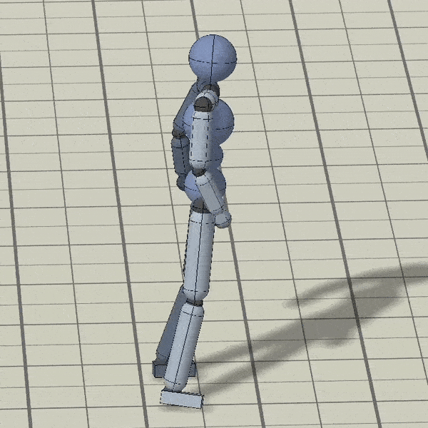

# BvhToMimic [WIP]

## Goal

The [DeepMimic project](https://github.com/xbpeng/DeepMimic) currently offers no way to import custom reference motions. This is shown in [DeepMimic issue #23](https://github.com/xbpeng/DeepMimic/issues/23). This project aims to transfer animation data from .BVH files into DeepMimic motion files. Motion files can then be used to train DeepMimic skills. Many thanks to user [SleepingFox88](https://github.com/SleepingFox88) for starting off the project. Original repository can be found [here](https://github.com/SleepingFox88/BvhToMimic). This repository currently works well with [this database](http://mocap.cs.sfu.ca/).

## Progress


(GIF has been generated using [this](http://mocap.cs.sfu.ca/nusmocap/0005_Walking001.bvh) mocap file from [this database](http://mocap.cs.sfu.ca/).)



Watch more videos of recorded conversions [here](https://www.youtube.com/playlist?list=PLd8lridYo1jPV26RsWZIGSJJew9nu4XSF).

## Dependencies

Python `sudo apt install python`

numpy `pip install numpy`

bvh `pip install bvh`

tqdm `pip install tqdm`

pyquaternion `pip install pyquaternion`

## Creating a settings file

Currently joints in .bvh files have to be manually assigned by name to the corresponding joints in the DeepMimic humanoid model. This is done by assigning the .bvh model's bone names to the corresponding joint properties in [./Settings/settings.json](./Settings/settings.json). On top of the joint assignments, this file should also include settings to change the scale by which the .bvh file should be transformed, and the joints used to identify the **root** rotation of the model.

## Running the project

```Bash
python BvhToMimic.py
```

Will convert all .bvh files located in /InputBvh/ into Mimic Motion files, located in /OutputMimic/

## Related Projects

[List of related projects](https://github.com/SleepingFox88/DeepMimic-Animation-Conversion)

### Notes

Most parts of this code have been developed within the [ACRO research group](https://iiw.kuleuven.be/onderzoek/acro).